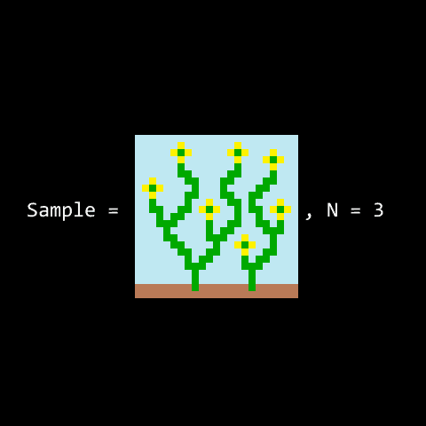

[](https://travis-ci.org/dpwdec/wfc-rust)


A graph based implementation of the Wave Function Collapse algorithm. This project improves on the flexibility and speed of the algorithm by decoupling its constraint solving functionality from input / output data and generalising parsing and rendering into graph structures allowing for speedy constraint propagation and easy conversion between media types.

This implementation:
1. Generalises and brings clarity to the constraint solving core of the algorithm.
2. Allows for input / output between arbitrary media types. For example, inputting image data for constraint generation and outputting sound data.
3. Modularises the structure of algorithm to improve run time on distributed services and make profiling and performance optimisation easier.

## Quick Start

1. `clone` this repo.
2. Create a new file with a valid input model inside `resources/test`. (See examples section for input examples) - or use one of the existing example files
3. `

## Background

The Wave Function Collapse algorithm is a constraint solving algorithm created by Maxim Gumin based on Paul Merrell's work in model generation and Paul F. Harrison's work in texture synthesis. Its primary application has been in generative media and games as a method for procedurally generating large amounts of original content from a small set of human defined inputs.



Since its release the algorithm has been ported across to many languages and content creation systems, however, because of the algorithms traditional area of application it has generally been implemented with fairly obfuscated data structures (such as nested three dimensional arrays) and strongly coupled with the process of parsing in input data making it difficult for users to understand how the constraint solving elements of the algorithm work and how to implement the algorithm in arbitrary n dimensional spaces and across many media types.

## Method

This implementation of WFC uses only Graph structures in the algorithm's `collapse` loop where the core constraint solving functionality occurs.

Graphs are an incredibly flexible data (and mathematical) structure that can be used to represent a wide range of input structures. We can use the edge-vertex structure of Graphs to represent n-dimensional spaces through n number of directed edges. For example, in a 1-dimensional space (a line), graph vertexes are connected by edges labelled with forwards and backwards. This approach generalises to higher input dimensions with the number of edge labels correlating with the number of discrete directions across each dimension. Furthermore, Graph structures can encode non-spatial discrete relationships, such as sequential relationship between words and word classes, or even temporal changes.

It follows that anything that can be reasonably parsed into Graph data can be constraint solved with this single implementation of the WFC algorithm; images, music, text, topological data etc. all with a single `collapse` loop. There are several advantages to this:
1. Code is DRY-er as a result and more easily maintainable.
2. Domain specific implementation details are entirely decoupled from the generative elements of the algorithm making it far more flexible.
3. The "hottest" part of the code is small and modularised making profiling and optimisation much easier.
4. Extending and debugging the algorithms core functionality is centralised into a single set of modules. Extending Graph `collapse` functionality once extends functionality for all possible input types.

A further advantage of using Graphs as the primary data structure for `collapse` is its simplicity and maintainability. `Graph` is a very simple `struct` with the indexes of `vertices` representing the index of an actual vertex in the graph with the value at that index composed of a set of possible labels. This implementation uses an adjacency matrix to represent `edges` implemented as an opinionated sparse matrix (to save on menmory) which supports access *from* one vertex to another in a discrete direction. We made the decision to implement the adjacencies in this more opinionated way because the edges are essentially only use to propagate information *from* one vertex *to* another and so we only require an injective function to move information from one part of the Graph to another.

```rust
struct Graph {
    vertices: Vec<HashSet<i32>>,
    edges: HashMap<VertexIndex, Vec<(VertexIndex, EdgeDirection)>>,
}
```

The algorithm is also generalised to be agnostic as to the state of the graph that is submitted for collapse, with the constraint solving core able to accept partially collapsed graphs as input as well as entirely uncollapsed graphs. This implementation of a more general input schema allows the aglorithm to:
1. Support checkpointing and spot processes in the code. The `collapse` process is a fairly computationally intensive task, so, should a process fail or have to be killed at some point along its run time the constraint `collapse` process will accept a partially collapsed Graph as input and continue constraint solving from that point
2. Work effectively with manipulated Graph data between the parse and collapse stages. Should you want to run further manipulations on Graph data, such as combining or filtering graphs, that alter the structure of the Graph or labels then `collapse` will still accept a manipulated graph as input to solve.

A final piece of modularisation is the entropy function and observation sorting. We implemented Shanon Entropy as our complexity heuristic, however the aglorithm's complexity heuristic is entirely modular. Sorting the complexity of vertices is done using a BinaryHeap data structure (as a min heap) such that the lowest entropy vertex to be observed is always at the top of the heap. This means, that we can easily implement and extend different methods for defining a complexity heuristic for vertices in the Graph as sorting is done automatically by the BinaryHeap.

# Structure

This section describes how each different part of the algorithm works. A primary goal with this implementation was to make WFC more transparent and extensible for other developers, if you are confused about the terms or concepts used here please see the `Q&A` section below where I attempt to explain some of the foundational concepts. If you are not at all familiar with WFC it might be helpful to start there.

## Overview

The algorithm takes in some form of input (image, sound, model data etc.) parses that input into a graph structure (the `input graph`) and then uses that graph structure to derive a set of constraints. Next the algorithm creates a differently sized (usually much larger) graph structure (the `output graph`) that has its vertices set to a superposition of all possible labels in the input graph. 

It then proceeds to collapse each set of labels at a vertex down to a single label by computing the entropy at a vertex's position and collapsing the least entropic vertices first. Finally when all vertices have only a single label the algorithm parses the `output graph` back into some useful form of real world output (not necessarily the same as input media type) and outputs it to the user.

```
┍━━━━━━━━━━━━━┑
│ Input Media │
┕━━━━━━━━━━━━━┙
       ⬇ (Parsed to)
┍━━━━━━━━━━━━━┑
│ Input Graph │
┕━━━━━━━━━━━━━┙
       ⬇
┍━━━━━━━━━━━━━━━━━━━━━━━━━┑
│ Derive Constraint Rules │
┕━━━━━━━━━━━━━━━━━━━━━━━━━┙
       ⬇
┍━━━━━━━━━━━━━━━━━━━━━┑
│ Create Output Graph │
┕━━━━━━━━━━━━━━━━━━━━━┙
       ⬇
┍━━━━━━━━━━━━━━━━━━━━━━━━━━┑
│ Collapse Graph (Core WFC)│
┕━━━━━━━━━━━━━━━━━━━━━━━━━━┙
       ⬇ (Rendered to)
┍━━━━━━━━━━━━━━┑
│ Output Media │
┕━━━━━━━━━━━━━━┙
```

## Parser-Renderer Pairs

The parser-renderer pair function as a prelude and coda to the core `collapse` algorithm making rule specification and i/o easier for human users. When input is submitted by a user it must come with a parser-renderer pair and an optional mapping.

- `Parser`: implements a process that accepts some input and outputs a Graph and Map that describes how to decode Graph.
- `Renderer`: implements a process that takes a Graph and a Map as input and uses it render the Graph into a human readable output.
- `Mapping`: An optional secondary Map that maps between differnent media types of dimensional spaces.

## Rules Generation

After the input has been parsed into a graph format a set of rules can be generated fairly simply by searching for each unique label and edge direction pairs and the possible set of labels they can connect to in the model graph.
```rust
// Rules data structure
HashMap<(EdgeDirection, VertexLabel), HashSet<VertexLabel>>
```
This is encoded as a Map that takes a tuple of a directed edge and a label as a key and has a set of possible labels as its value.

## The `collapse` Constraint Solving Loop

### Overview

At its core this implementation of WFC takes some uncollapsed graph, assigns an entropy value to each vertex on the graph based on its set of labels and uses a process of elimination to remove possibilities of vertex positions until the algorithm reaches a contradition, in which case it fails or the graph is fully collapsed.

`OBSERVE`-ing a vertex means to collapse its set of possible labels down to singleton set.

`PROPAGATE`-ing a vertex's information means to find vertices that are connected to vertex where information has changed and constrain them based on the new information.

```
LOOP:
  IF the information in the graph changed due to a collapse or propagation:
    PROPAGATE information (constraints) between connected vertices

  ELSE IF there are vertices to collapse
    OBSERVE the vertex with the lowest entropy

  ELSE IF there are no vertices left to collapse
    OUTPUT the collapsed graph

```
In the interest of simplicty and to help readers to understand the core solving loop of the algorithm the pseudo code above does not show the failure case which occures if a propagation constrains the set of possible labels at a vertex to be empty (i.e. a labels set of size `0`) which would mean that the algorithm reached a contradiction in its constraint solving and failed. This check for a label set of `0` occurs after the `PROPAGATE` step.

### Data Structures

- `Observe`: Represents a possible observation and the entropy of a vertex to be observed at the time it was created.
- `Propagate`: Represents a propagation `from` a vertex `to` another vertex in along a a directed edge.
- `Heap: BinaryHeap<Observe>`: A [min heap] of `Observe` actions storing the Observe with the lowest entropy on top.
- `Observed: Set<VertexIndex>`: A list recording which vertices have been collapsed to a singleton set.
- `Propagations: Vec<Propagate>`: A stack of `Propagate` actions representing a queue of constraint propagations that need to take place.
- `gen_observe: Vec<VertexIndex>`: An array of vertexes the entropy of which has changed during the propagation process and need to have new `Observe` operations generated for them.

### Initialization
This the pseudocode for initialization of the algorithm. The main function of this code is to initialise the `Heap` of `Observe` actions and the initial entropy of the Graph's vertices as well as allow for partially collapsed Graphs as input.
```
FOR EACH vertex IN output_graph:
    IF vertex.labels EQUAL TO PROPER SUBSET OF all_labels:
        FOR EACH other_vertex IN vertex.connections:
            PUSH Propagate.new ONTO Propagations

    IF vertex.labels IS SINGLETON SET:
        ADD vertex TO Observed
        CONTINUE // Skips last command in this FOR EACH
    
    PUSH Observe.new FOR vertex ONTO Heap
```

### Constraint Solving `collapse` Loop Deep Dive
This pseudocode shows the basic logic for the core loop of the `collapse` algorithm and how constraint solving is used to collapse the Graph. 
```
LOOP:
    IF Observed.length == Graph.vertices.length:
        RETURN Graph // Success!

    IF Heap.is_empty:
        RETURN Graph // Success!

    ELSE IF Propagations.is_empty:
        IF gen_observe.not_empty:
            FOR EACH vertex IN gen_observe:
                PUSH Observe.new FOR vertex ONTO Heap
            
            EMPTY gen_observe

        POP Observe OFF Heap // Returns lowest entropy Observe

        COLLAPSE Observe.vertex.labels // Labels -> Singleton Set
        FOR EACH other_vertex IN Observe.vertex.connections:
            PUSH Propagate.new ONTO Propagations
            
    ELSE:
        POP a Propagate OFF Propagations

        COMPOSE SET OF LABEL constraints // Set up constraints

        INTERSECT Propagate.to_vertex.labels WITH constraints
        IF Propagate.to_vertex.labels CHANGED:
            IF Propagate.to_vertex.labels.is_empty:
                RETURN Error // Failure!
            ELSE IF Propagate.to_vertex.labels.is_singleton:
                ADD Propagate.to_vertex TO observed
            ELSE:
                ADD Propagate.to_vertex TO gen_observe
            
            FOR EACH other_vertex IN Observe.to_vertex.connections:
                IF other_vertex NOT IN Observed:
                    PUSH Propagate.new ONTO Propagations
```

## Explanations

#### What is a graph?

The term graph used in the context of this implementation of the algorithm refers to the definition of a graph used in the mathematical field of Graph Theory. A graph is a structure consisting of *vertices*, *edges* and *labels*. The set of vertices of a graph are connected by a set edges. Each vertex can be *labelled* with a value. Edges can also be labelled with a direction.

```
1a --- 2b
|      |
|      |
3c --- 4a
```
Above is a simple rendering in text of a very simple Graph that might be use as a model for the `collapse` process. It has four vertices with indexes `1 - 4`. Each vertex is labelled with a letter, `a`, `b` or `c`. Vertices are connected by edges, for example, vertex `1` is connected to vertex `3` and `2`. 

Although not labelled here we could imply that there are certain directional relationships between the vertices as well. For example, vertex `3` connects to vertex `4` to the `East` and vertex `4` connects to vertex `2` to the `North`.

The Graph structure in the algorithm would have these edge directions explicitly labelled for it but for the purposes of understanding a basic Graph they have been omitted. However, its worth noting that edge labels are highly arbitrary and could be used to encode almost any discrete relationship between two pieces of information, it has simply been used to encode a spatial (NSEW) example here.

#### What is an uncollapsed Graph?

An uncollapsed graph is a graph in which one or more vertices of the graph is in some superposition i.e. contains a set of labels great than one. The term superposition is used because it refers to the WFC algorithm's modelling of the constraint solving possibility space as similar to a quantum particle that can be in many states until it is observed at which point it collapses down to a *definite* position; the process of reducing a set of possible labels to a singleton set.

#### What is entropy and why is it useful?

This implementation of WFC uses classical shannon entropy as a complexity heuristic for ordering vertices. 

A complexity heuristic is simply a method for simulating the natural human ability to assesss and pick the simplest most invariant parts of a problem to solve first before moving onto the more complex less predictable parts of a problem.

For example, if you try to solve a sodoku puzzle you generally begin by finding all the the numbers you can fill in with 100% certainty before moving onto parts of the problem that has a possible set of numbers that you could fill in. The entropy complexity heuristic mirrors this natural human problem solving heuristic by assign a numeric value to how many possibilities and how likely those possibilities are at a vertex in the output graph and there how likely collapsing the label set at a particular vertex is to lead to a contradiction.

For example, if a vertex has a set of labels that appear very frequently in the input Graph then its likely that that vertex has fairly low entropy because the high frequency in the input correlates to compatability with many other possible labels. However, if the vertex only contains very rare labels its entropy will be high as collapsing it down before constraining other parts of the output space is likely to lead to cotradictions.


#### How is shannon entropy calculated?

Shannon entropy is given by the equation below and describes abstract informational entropy.

=-\sum _{i=1}^{n}{\mathrm {P} (x_{i})\log _{b}\mathrm {P} (x_{i})}}")

- `H(X)`: The input to the equation.
- `n`: The number of total possible labels.
- `P(x)`: The probability of the input element `x` appearing in the set which is calculate by `frequency of x / entire set`
- `log(b)`: Converts the output entropy of the function to different significant units. For the purposes of this algorithm we use `log2`.

#### What is an adjacency matrix?

An adjacency matrix is a method for simply encoding directions and connections between different nodes.
`Example Graph`:
```
1b --- 2c
|      |
0a --- 3b
```

Given the example graph above the directional relationship between the nodes in the graph can be encode in the adjacency matrix below. This is assuming that the graph encodes 4 cardinal directions in 2-dimensional space. As we can see, vertex `3` connects to vertex `2` in the north and does not connected to vertex `1`. If we read down the `3` column we can see that at row `1` there is a `0`, indicating no connection between these two nodes. In row `2` there is a `1` which encodes the `North` direction.

`Adjacency Matrix`:
```
North: 1, South: 2, East: 3, West: 4, No connection: 0

    0     1     2     3  ⬅ FROM vertex index
 ━╋━━━━━╋━━━━━╋━━━━━╋━━━━
0 ┃  0  ┃  2  ┃  0  ┃ 4
 ━╋━━━━━╋━━━━━╋━━━━━╋━━━━
1 ┃  1  ┃  0  ┃  4  ┃ 0
 ━╋━━━━━╋━━━━━╋━━━━━╋━━━━
2 ┃  0  ┃  3  ┃  0  ┃ 1
 ━╋━━━━━╋━━━━━╋━━━━━╋━━━━
3 ┃  3  ┃  0  ┃  2  ┃ 0
⬆
TO vertex index
```

## Walkthrough of `collapse`

The following is a step by step walkthrough of the core `collapse` algorithm process on a very simple input as a way to help users understand what is going on when they use this tool.

The model graph below shows an example input that the `collapse` algorithm might receieve as input. This graph is intended to represent a 2-dimensional space with 4 directions for edge labelling: North, South, East and West.

`Model graph`:
```
1b --- 2b
|      |
|      |
0a --- 3b
```

Therefore the rules that this model graph would generate are as follows:

`Rules`:
```
Key         Value
━━━━━━━━━━━╋━━━━━━━━━━
(North, a) ┃  {b}
(North, b) ┃  {c}
(South, b) ┃  {a}
(South, c) ┃  {b}
(East, a)  ┃  {b}
(East, b)  ┃  {c}
(West, b)  ┃  {a}
(West, c)  ┃  {b}
```

After this initialisation the algorithm can then begin to run and generate constraints until it results in an entirely collapsed graph.

`Collapse loop process`:
```
1abc --- 2abc       Heap: Observe(0), Observe(1), Observe(2), Observe(3)
|        |          gen_observe: []
|        |          observed: []
0abc --- 3abc       propagations: []

POP Observe(0) OFF Heap // Vertex with lowest entropy to collapse

RUN Observe(0) // collapse the vertex to a singleton set

FOR EACH vertex CONNECTED TO Observe(0).vertex:
    PUSH Propagate.new TO propagations
```

```
1abc --- 2abc       Heap: Observe(1), Observe(2), Observe(3)
|        |          gen_observe: []
|        |          observed: 0
0a ----- 3abc       propagations: Propagate(0, 1), Propagate(0, 3)

POP Propagate(0, 1) OFF propagations

RUN Propagate(0, 1) // propagate constraints from vertex 0 to vertex 1

FOR EACH vertex CONNECTED TO Propagate(0, 1).to_vertex:
    PUSH Propagate.new TO propagations // in this case vertex 1 is conncted to vertex 2
```

```
1ab ---- 2abc       Heap: Observe(1), Observe(2), Observe(3)
|        |          gen_observe: [1]
|        |          observed: [0]
0a ----- 3abc       propagations: Propagate(1, 2), Propagate(0, 3)

RUN Propagate(1, 2)
```

```

1ab ---- 2c         Heap: Observe(1), Observe(2), Observe(3)
|        |          gen_observe: [1]
|        |          observed: [0, 2]
0a ----- 3abc       propagations: Propagate(2, 3), Propagate(2, 1), Propagate(0, 3),

RUN Propagate(2, 3)
```

```
1ab ---- 2c         Heap: Observe(1), Observe(2), Observe(3)
|        |          gen_observe: [1, 3]
|        |          observed: [0, 2]
0a ----- 3ab        propagations: Propagate(2, 1), Propagate(0, 3)

RUN Propagate(2, 1)
```

```
1ab ---- 2c         Heap: Observe(1), Observe(2), Observe(3)
|        |          gen_observe: [1, 3]
|        |          observed: [0, 2]
0a ----- 3ab        propagations: Propagate(0, 3)

RUN Propagate(0, 3)
```

```

1ab ---- 2c         Heap: Observe(1), Observe(2), Observe(3)
|        |          gen_observe: [1, 3]
|        |          observed: [0, 2, 3]
0a ----- 3b         propagations: []

IF propagations.is_empty:
    FOR EACH vertex IN gen_observe:
        IF vertex NOT IN observed:
            PUSH Observe.new TO Heap
```
```

1ab ---- 2c         Heap: Observe(1), Observe(1), Observe(2), Observe(3)
|        |          gen_observe: []
|        |          observed: [0, 2, 3]
0a ----- 3b

RUN Observe(1)
```

```

1b ----- 2c         Heap: Observe(1), Observe(2), Observe(3)
|        |          gen_observe: []
|        |          observed: [0, 1, 2, 3]
0a ----- 3b

ALL vertices OBSERVED -> RETURN
```


## Examples

### Text based tile maps:

`Input`:
```
🗻🗻🗻⛩🗻🗻🗻
🗻🌳🗻🗻🗻🗻🗻
🌳🌳🌳🌳🌳🌳🌳
🌳🌳🌳⛩🌳🌊🌳
🌊🌊🌊🌊🌊🌊🌊
🌊🌊🌊🌊🌊🌊🌊
🌊🌊🌊🌊🌊🌊🌊
```

`Output`:
```
🌳🗻🗻🗻⛩🗻🗻⛩🌳⛩🗻🗻🗻🗻🗻🗻🗻🗻🗻🗻
⛩🗻🗻🗻🗻🗻🗻🗻🌳🗻🌳🗻🗻🗻🗻🗻🗻🗻🗻🗻
🗻🌳🗻🗻🗻🗻🗻🗻🌳🌳🌳🌳🗻🌳🗻🗻🗻🗻🌳🗻
🗻⛩🗻🗻🗻🗻🗻🌳🌳🌳🌳🌳🗻🌳🗻🗻🌳🗻🌳🌳
🗻🗻🗻🗻🌳🗻🌳🌳🌳🌳🌳🌳🗻🌳🗻🌳🌳🗻🌳⛩
🗻🌳🗻🌳⛩🗻🌳⛩🌳🌳🌳🌊🌳🌳🗻🌳🌊🌳🌊🌊
🗻🌳🗻🌳🗻🌳🌳🌊🌳🌳🌊🌊🌳⛩🗻🌳🌊🌳🌊🌊
🌳⛩🌳🌳🗻🌳🌳🌊🌳🌳🌊🌊🌳🗻🌳🌊🌊🌳🌊🌊
🌊🌊🌳🌊🌳🌊🌳🌊🌊🌳🌊🌊🌳🗻🌳🌊🌊🌊🌊🌊
🌊🌊🌳🌊🌳🌊🌊🌊🌊🌊🌊🌊🌳🌳🌳🌊🌊🌊🌊🌊
🌊🌊🌊🌊🌊🌊🌊🌊🌊🌊🌊🌊🌊🌊🌊🌊🌊🌊🌊🌊
```


